# Atlas - Batch Log Analytics & Metadata Pipeline

Project ATLAS is a batch-oriented AWS log analytics pipeline designed to ingest heterogeneous application logs, normalize them into a canonical schema, and produce deterministic, analytics-ready datasets.

 

The pipeline prioritizes **correctness, reproducibility, and operational clarity** over real-time ingestion. It reflects real-time data engineering tradeoffs such as late-arriving data, corrected files, duplicates, and safe reprocessing.

- **⚙️ Domain:** Data Engineering | Analytics Engineering
- **🧠 Stack:** AWS • Glue • Step Functions • S3

---

## Pipeline Layers Architecture

```mermaid
flowchart TB
    subgraph RAW["raw/ (Landing Zone)"]
        R1["Incoming Log Files (NDJSON, JSON.GZ, XML)"]
    end
    subgraph INGEST["Ingestion & Validation"]
        L1["Lambda Ingestion • detect format • extract event date • route file"]
    end
    subgraph VALIDATED["validated/ (File-Level Correctness)"]
        V1["validated/format/year=YYYY/month=MM/day=DD/"]
    end
    subgraph PROCESSED["processed/ (Silver Layer)"]
        G1["Glue Job 1 Normalization"]
        P1["processed/logs/log_type=access|error/year/month/day (Parquet)"]
    end
    subgraph ANALYTICS["analytics/ (Gold Layer)"]
        G2["Glue Job 2 Daily Aggregation"]
        A1["analytics/daily_activity/date=YYYY-MM-DD"]
    end
    subgraph CATALOG["Query Layer"]
        C1["Glue Data Catalog"]
        Q1["Athena"]
    end
    subgraph REJECTED["Rejected Data"]
        RJ1["rejected/system/"]
        RJ2["rejected/data_quality/"]
        RJ3["rejected/system/"]
    end
    
    R1 --> L1
    L1 -->|pass| V1
    L1 -->|fail| RJ1
    V1 --> G1
    G1 -->|valid records| P1
    G1 -->|row-level issues| RJ2
    G1 -->|job failure| RJ3
    P1 --> G2
    G2 --> A1
    P1 --> C1
    A1 --> C1
    C1 --> Q1

```


The pipeline enforces a clear, layered data flow: files are validated at ingestion time, normalized at the record level in the processed (silver) layer, and aggregated into deterministic, overwrite-by-day analytics (gold). Each layer has a single responsibility, enabling safe reprocessing and reliable metrics.

---

## Why this Project Exists

SaaS platforms generate logs from multiple systems:
- web applications
- APIs
- background services
- error monitoring systems

These logs arrive:
- in different formats
- at different times
- sometimes incorrect and later corrected

Querying raw logs directly leads to:
- inconsistent metrics
- duplicated counts
- fragile dashboards
- unsafe reprocessing

This project introduces **clear data stages**, **explicit time handling**, and **deterministic batch processing** to solve these problems.

---

## Core Principles

- **Batch-first design** for correctness and reprocessing
- **Explicit data layers** (raw → validated → processed → analytics)
- **Time handled by orchestration**, not jobs
- **Duplicates tolerated upstream**, resolved downstream
- **Analytics layer is authoritative**

---
## Core Design Philosophy

This pipeline is built around the following principles:

### 1. Batch Over Streaming
This pipeline intentionally avoids streaming.

Batch processing:
- simplifies correctness
- enables safe reprocessing
- makes late data and corrections manageable
- reduces operational and cost complexity

Streaming can be added later, but correctness comes first.

---

### 2. Explicit Data Stages
Each stage has a clear responsibility and contract:

- **Raw**: immutable landing zone
- **Validated**: file-level correctness and partitioning
- **Processed (Silver)**: normalized, analytics-friendly records
- **Analytics (Gold)**: authoritative, business-facing datasets

Data is never silently reused across stages.

---

### 3. Time Is an Orchestration Concern
Processing jobs do **not infer time**.

All batch jobs operate on an explicit `process_date` supplied by orchestration.
This enables:
- safe backfills
- deterministic reruns
- reproducible analytics

---

### 4. Duplicates Are a Data Reality
Duplicates are tolerated **upstream** and resolved **downstream**.

- Processed (silver) data may contain duplicates
- Analytics (gold) data is authoritative and deterministic

This mirrors real production systems.

---

## Pipeline Architecture


# Data Flow

1. Logs are uploaded to the `raw` S3 prefix
2. An S3 event triggers the ingestion Lambda
3. Lambda inspects the file and extracts event dates
4. The file is copied into the appropriate validated partition
5. Glue Job 1 processes validated data for a specific day
6. Normalized data is written to processed partitions
7. Glue Job 2 aggregates processed data into analytics tables
8. Crawlers update metadata for query access

# Component Responsibilities

## S3
Acts as the durable storage layer for all stages.

## Lambda
Handles ingestion-time concerns:
- File validation
- Event-date extraction
- Partition routing

## Glue Job 1
Normalizes heterogeneous logs into a canonical schema.

## Glue Job 2
Aggregates normalized logs into analytics tables.

## Glue Crawlers
Expose datasets through the Glue Data Catalog.

## Step Functions
Orchestrates batch execution order and preserves execution context.

## EventBridge
Controls when the pipeline runs and which date is processed.


---

# Data Sources & Formats

Atlas supports multiple log formats commonly found in SaaS systems.

## NDJSON
- Line-delimited JSON  
- Typically web access logs  

## GZIP JSON
- Compressed JSON payloads  
- Typically API gateway logs  

## XML Error Logs
- Structured error records  
- Parsed using regex-based extraction  
- Avoids external Spark XML dependencies  

Each format is parsed independently and mapped into the same canonical schema.

---

## How to use this repo
1. Review `docs/` for detailed architecture, flow, and operational steps.
2. Place production-ready scripts in `scripts/` (Glue jobs and Lambda).
3. Deploy Lambda to validate files dropped to `raw/`.
4. Deploy Glue job for raw->processed (bronze/silver).
5. Deploy the gold compaction Glue job to run periodically or on-demand.
6. Configure Glue crawlers and Athena for querying the processed and gold layers.

---

# 🔐 IAM Roles & Access Model (Summary)

Atlas uses separate, least-privilege IAM roles for each service.  
No role is shared across services, and each role is scoped strictly to the actions  
required for its responsibility in the pipeline.

---

## IAM Role Overview

| IAM Role | Used By | Purpose |
|--------|--------|--------|
| atlas-lambda-ingestion-role | Lambda | File ingestion, validation, and routing |
| atlas-glue-etl-role | Glue Jobs | Log parsing, normalization, and aggregation |
| atlas-step-functions-role | Step Functions | Orchestration of Glue jobs and crawlers |
| atlas-eventbridge-role | EventBridge | Triggering scheduled pipeline executions |
| atlas-glue-crawler-role | Glue Crawlers | Metadata discovery and schema updates |

---

## Role Responsibilities & Permissions

### 1. Lambda Ingestion Role  
**Role:** `atlas-lambda-ingestion-role`  
**Used by:** Ingestion Lambda  

**Allows:**
- `s3:GetObject` on `raw/`
- `s3:PutObject` on `validated/`
- `s3:DeleteObject` on `raw/`
- `logs:CreateLogGroup`, `logs:CreateLogStream`, `logs:PutLogEvents`

**Purpose:**
- Read newly uploaded files  
- Route files into validated date partitions  
- Remove files from raw after successful ingestion  
- Emit operational logs  

---

### 2. Glue ETL Role  
**Role:** `atlas-glue-etl-role`  
**Used by:**  
- Glue Job 1 (Normalization – Silver)  
- Glue Job 2 (Aggregation – Gold)  

**Allows:**
- `s3:GetObject` on `validated/` and `processed/`
- `s3:PutObject` on `processed/` and `analytics/`
- `s3:PutObject` on `rejected/` (data quality & system failures)
- `sns:Publish` (job summaries & alerts)
- `logs:*` for Glue job logging
- `glue:GetTable`, `glue:GetDatabase`

**Purpose:**
- Parse and normalize logs  
- Write partitioned Parquet outputs  
- Aggregate analytics datasets  
- Publish processing summaries  

---

### 3. Step Functions Execution Role  
**Role:** `atlas-step-functions-role`  
**Used by:** AWS Step Functions  

**Allows:**
- `glue:StartJobRun`
- `glue:GetJobRun`
- `glue:StartCrawler`
- `glue:GetCrawler`
- `logs:*`

**Purpose:**
- Orchestrate Glue jobs and crawlers  
- Enforce execution order  
- Preserve `process_date` across steps.  

---

### 4. EventBridge Invocation Role  
**Role:** `atlas-eventbridge-role`  
**Used by:** Amazon EventBridge  

**Allows:**
- `states:StartExecution` on the Step Function state machine  

**Purpose:**
- Trigger daily pipeline execution  
- Inject `process_date` for scheduled runs  

---

### 5. Glue Crawler Role  
**Role:** `atlas-glue-crawler-role`  
**Used by:** Glue Crawlers  

**Allows:**
- `s3:GetObject` on `processed/` and `analytics/`
- `glue:CreateTable`
- `glue:UpdateTable`
- `glue:GetDatabase`
- `logs:*`

**Purpose:**
- Discover new partitions  
- Update schemas in the Glue Data Catalog  
- Enable Athena querying  

---

## Security Principles Applied

- Least privilege: no wildcard permissions on critical actions  
- Role isolation: no service shares a role  
- No human access to ETL roles  
- Explicit stage boundaries in S3 access  

---

## Why This Matters

This IAM model:
- Prevents accidental cross-stage writes  
- Limits blast radius of failures  
- Makes audits and debugging straightforward  
- Reflects real production security practices

---

## Folder structure (Repository)

```
atlas-batch-log-analytics/
│
├── .git/
│
├── README.md
│
├── docs/
│   ├── architecture.md
│   ├── athena_queries.md
│   ├── dataflow.md
│   ├── file_movement.md
│   ├── glue_crawlers.md
│   ├── glue_etl.md
│   ├── gold_job.md
│   ├── iam_roles_permissions.md
│   ├── job_parameters.md
│   ├── lambda_validation.md
│   ├── monitoring.md
│   ├── rejects.md
│   ├── s3_layout.md
│   ├── schema_mapping.md
│   ├── scripts.md
│   ├── timestamp_parsing.md
│   ├── troubleshooting.md
│   └── validation.md
│
├── imgs/
│   └── (architecture and data flow images)
│
├── sample-dataset/
│   ├── 2024-11-29/
│   │   ├── access_logs_2024-11-29.ndjson
│   │   ├── api_logs_2024-11-29.json
│   │   └── errors_2024-11-29.xml
│   │
│   └── 2024-11-30/
│       ├── access_logs_2024-11-30.ndjson
│       ├── api_logs_2024-11-30.json
│       └── errors_2024-11-30.xml
│
└── scripts/
    ├── log_analytics_glue_job1.py
    ├── log_analytics_glue_job2.py
    └── lambda_validator.py

```

---

# 📫 Contact

## Oluwatosin Amosu Bolaji 
- Data Engineer 
- Buiness Intelligence Analyst
- ETL Developer

#### 🚀 **Always learning. Always building. Data-driven to the core.**  

### 📫 **Let’s connect!**  
- 📩 oluwabolaji60@gmail.com
- 🔗 : [LinkedIn](https://www.linkedin.com/in/oluwatosin-amosu-722b88141)
- 🌐 : [My Portfolio](https://www.datascienceportfol.io/oluwabolaji60) 
- 𝕏 : [Twitter/X](https://x.com/thee_oluwatosin?s=21&t=EqoeQVdQd038wlSUzAtQzw)
- 🔗 : [Medium](https://medium.com/@oluwabolaji60)
- 🔗 : [View my Repositories](https://github.com/Tbrown1998?tab=repositories)