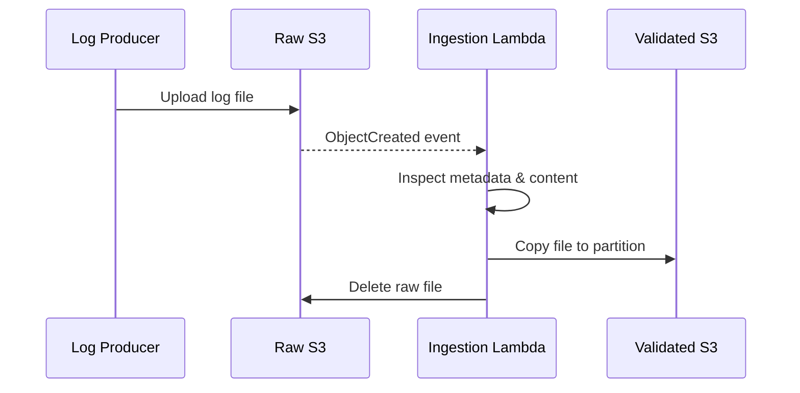

# Ingestion Layer — Lambda & File Movement

The ingestion layer is the **entry point** into the Atlas pipeline. Its responsibility
is to safely transition raw log files from uncontrolled external inputs into a
structured, partitioned, and processable state within the data lake.

This document explains:
- why ingestion is event-driven
- what Lambda does and does not do
- how file movement is handled
- how partitions are created
- how concurrency, retries, and edge cases are handled

---

## Purpose of the Ingestion Layer

In Atlas, ingestion is intentionally **file-centric**, not record-centric.

The ingestion layer exists to:
- detect the arrival of new log files
- validate them at a *file level*
- determine the correct processing date
- place them into the correct data lake partition

It explicitly does **not**:
- parse individual log records
- enforce schemas
- deduplicate data
- compute analytics

Those responsibilities belong to batch processing (Glue).

---

## Why Lambda Is Used for Ingestion

Lambda is used because ingestion is:
- event-driven
- lightweight
- bursty
- stateless

Using Lambda allows Atlas to:
- react immediately when files arrive
- scale automatically with file volume
- avoid long-running ingestion services
- keep ingestion cost minimal

This matches real-world ingestion patterns where files arrive at unpredictable times.

---

## Ingestion Trigger Mechanism

Lambda is triggered by **S3 ObjectCreated events** on the raw bucket/prefix.

### Trigger characteristics:
- One invocation per uploaded object
- Independent processing per file
- At-least-once delivery semantics

This means:
- Multiple files arriving simultaneously result in parallel Lambda invocations
- The ingestion logic must be idempotent at the file level

---

## File-Level Processing Model

Each Lambda invocation processes **exactly one file**.

The file is treated as:
- an opaque object
- with minimal inspection
- and no record-level parsing

### Ingestion flow:



---

## File Format Detection

Lambda determines file type using:
- file extension
- S3 object metadata (where available)

Supported formats:
- `.ndjson`
- `.json.gz`
- `.xml`

This detection is intentionally simple.

Why:
- File naming conventions are reliable at ingestion time
- Deep inspection is expensive
- Parsing belongs in Spark, not Lambda

---

## Event Date Extraction

One of Lambda’s most important responsibilities is event date extraction.

Lambda:
- reads a minimal portion of the file
- extracts timestamps from representative records
- determines the logical event date

This date determines:
- the partition the file is written to
- the day on which it will be processed

### Why event date (not arrival date)?

Because:
- logs may arrive late
- retries may cause re-uploads
- arrival time does not reflect business time

Using event timestamps ensures analytics correctness.

---

## Partition Routing Logic

Validated files are written to partitions of the form:

```
validated/<format>/year=YYYY/month=MM/day=DD/
```

Examples:

```
validated/ndjson/year=2024/month=11/day=29/
validated/xml/year=2024/month=11/day=29/
```

Lambda creates partitions implicitly by writing to the path.
No manual folder creation is required.

This design:
- removes operational friction
- scales naturally
- avoids human error

---

## File Movement Semantics (Copy + Delete)

Atlas uses move semantics, implemented as:
- Copy file from raw → validated
- Delete file from raw

This is a deliberate design choice.

### Why not copy-only?

Copy-only ingestion would:
- allow accidental reprocessing
- blur stage boundaries
- make lineage unclear

By deleting from raw:
- each file has a single owner stage
- reprocessing is explicit
- ingestion remains idempotent

---

## Handling Duplicate File Uploads

If the same file is uploaded multiple times:
- Each upload triggers Lambda
- Each copy is routed to the same partition
- Glue Job 1 may see duplicate records

This is expected behavior.

Atlas resolves duplicates:
- downstream
- deterministically
- at the analytics layer

Trying to deduplicate at ingestion time is fragile and error-prone.

---

## Concurrency & Scale

Lambda scales automatically based on:
- number of incoming files
- S3 event throughput

Key properties:
- No shared state between invocations
- No locking required
- No coordination between files

This allows Atlas to handle:
- bursts of uploads
- large daily file counts
- multiple producers simultaneously

---

## Failure Scenarios & Retries

### If Lambda fails before copy
- Raw file remains
- S3 event may retry
- File is ingested later

### If Lambda fails after copy but before delete
- File exists in both raw and validated
- Raw file may trigger another invocation
- Duplicate ingestion may occur

This is acceptable.

Why:
- Ingestion is at-least-once
- Duplicates are handled downstream
- Correctness is preserved

---

## Why Lambda Does Not Validate Records

Record-level validation is explicitly out of scope for ingestion.

Reasons:
- Lambda has limited execution time
- Parsing large files is expensive
- Schema validation evolves over time
- Spark is better suited for record processing

This separation keeps ingestion:
- fast
- reliable
- simple

---

## Operational Observability

Lambda emits:
- CloudWatch logs per invocation
- Basic metrics (invocations, errors)

It does not emit business metrics.
Those are produced by Glue Job 1, where full context exists.

---

## Design Tradeoffs

### Benefits
- Simple ingestion logic
- High scalability
- Clear stage ownership
- Low cost

### Tradeoffs
- Duplicates may exist temporarily
- File-level failures may require re-uploads
- Requires downstream discipline

These tradeoffs are intentional and documented.

---

## Summary

The ingestion layer in Atlas is deliberately minimal.

Its role is to:
- move files safely
- place them correctly
- get out of the way

By deferring complexity to batch processing, Atlas remains robust, scalable,
and easy to reason about under real-world conditions.
