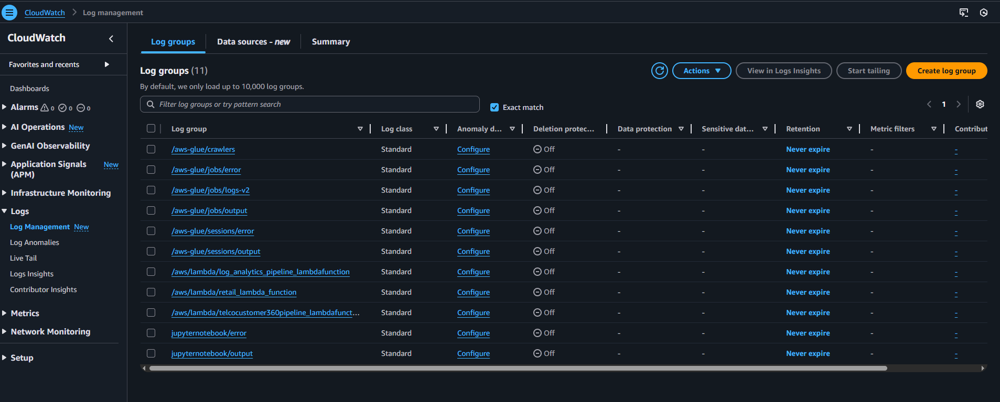

# Monitoring & Alerting

Atlas uses built-in AWS observability features.

---

## Monitoring

- CloudWatch logs for Lambda and Glue
- Step Functions execution history

---

## Alerting

- SNS notifications from Glue Job 1
- Failures surface at orchestration level

---

## Summary

Failures are visible and actionable.
