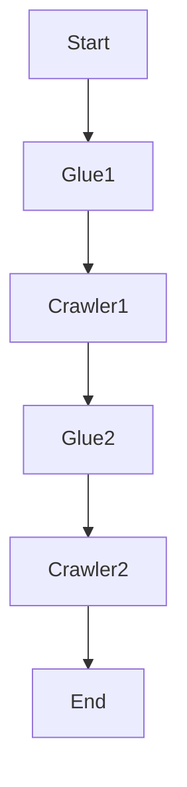

# Step Functions Orchestration

Step Functions orchestrate the batch execution of Atlas.

They define **what runs, in what order, and with what inputs**.

---

## Why Step Functions

Step Functions are used because they:
- provide explicit execution order
- preserve execution state
- integrate cleanly with Glue and Crawlers
- make failures visible and debuggable

They are simpler than full workflow engines and well-suited for batch pipelines.

---

## Orchestration Flow

Each step must complete successfully before the next begins.

---

## State Management

A key design detail is the use of `ResultPath`.

Without it:
- task outputs would overwrite the state input
- `process_date` would be lost

By storing task results separately, the execution context is preserved.

---

## What Step Functions Do Not Do

Step Functions do not:
- schedule runs
- infer dates
- inspect S3 contents
- validate data correctness

They exist purely to coordinate execution.

---

